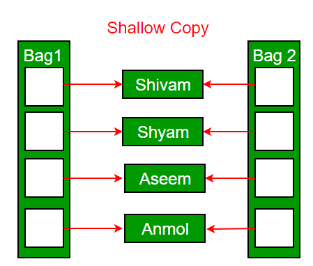

<!--
 * @Author: Uper 41718895+Hyliu-BUAA@users.noreply.github.com
 * @Date: 2022-05-29 14:48:52
 * @LastEditors: Uper 41718895+Hyliu-BUAA@users.noreply.github.com
 * @LastEditTime: 2022-05-29 18:04:36
 * @FilePath: /C_C++/C++_拷贝控制/notes/Copy_Constructor.md
 * @Description: 这是默认设置,请设置`customMade`, 打开koroFileHeader查看配置 进行设置: https://github.com/OBKoro1/koro1FileHeader/wiki/%E9%85%8D%E7%BD%AE
-->
# Copy constructor in C++
<font color="73DB90" size="4">

1. A `copy constructor` is a memeber function that intialize an object using another object of the same class.
2. A copy constructor has the following general function prototype:
```c++
ClassName (const ClassName &old_obj);
```

</font>


# 1. Demo 1. 拷贝构造函数的简单例子
```c++
// C++ program to demonstrate the working 
// of `copy constructor`
#include <iostream>


class Point {

private:
    int x, y;

public:
    // Constructor Function
    Point(int x1, int y1) {
        std::cout << "Calling constructor...\n";
        x = x1;
        y = y1;
    }

    // Copy Constructor
    Point(const Point& p1) {
        std::cout << "Calling copy constructor...\n";
        x = p1.x;
        y = p1.y;
    }

    int getX()  { return x; }
    int getY()  { return y; }

};


int main() {
    Point p1(10, 15);
    Point p2 = p1;

    return 0;
}
```
Output:
```shell
$ g++ -Og -std=c++20 test.cpp -o test
$ ./test 
Calling constructor...
Calling copy constructor...
```


# 2. When is the copy constructor called?
<font color="73DB90" size="4">

In C++, a `Copy constructor` may be called in the following cases:
1. When an object of the class is returned by value(`not reference`).
2. When an object of the class is passed (to a function) by value as an argument.
3. When an object is constructed based on another object of the same class.
4. <font color="orange">When the compiler generates a temporary object.</font>

</font>

<font color="red" size="4">

Note
----
1. It is, however, `not guaranteed that a copy constructor will be called in all these cases`, because the C++ Standard allows the compiler to optimize the copy away in certain cases, one example is the return value optimization (sometimes referred to as RVO).

</font>


# 3. Copy Elision
<font color="73BD90" size="4">

1. In `copy elision`, the `compiler` `prevents the making of extra copies` which results in saving the space and better the program complexity (`both time and space`); Hence making the code more optimized.

</font>


## 3.1. Demo 2. Copy Elision
```c++
// C++ program to demonstrate the working of copy elision
#include <iostream>


class GFG {

public:
    void print() {
        std::cout << "Hello Dear!!!\n";
    }

};


// Main Function
int main() {
    GFG g;
    for (size_t i = 0 ; i <= 2; i++ ) {
        g.print();
    }
    return 0;
}
```

Output:
```shell
$ g++ -Og std=c++20 test.cpp -o test
$ ./test
Case 1: 
      Hello Dear!
      Hello Dear!
      Hello Dear!

Case 2: 
      Hello Dear!
      Hello Dear!

Case 3: 
      Hello Dear!
```

<font color="73DB90" size="4">

Return Value Optimization (`RVO`)
---------------------------------
1. Now it is on the compiler to decide what it wants to print, it could either print the above output or it could print case 1 or case 2 below, and this is what `Return Value Optimization` is. 
2. In simple words, `RVO` is a technique that gives compiler some additional power to terminate the temporary object created which results in changing the observable behavior/characteristics of the final program.

</font>


# 4. When is a `user-defined copy constructor` needed? 
<font color="73DB90" size="4">

1. If we don't define our own copy constructor, the `C++ compiler` creates `a deafault copy  constructor for each class` which does a member-wise copy between objects.
2. We need to define our own copy constructor only if `an object has pointer or any runtime allocation of the resource`.
3. The defualt constructor does only `shallow copy`.

4. `Deep copy` is possible only with a `user-defined copy constructor`.
    - In a `user-defined copy constructor`, we make sure that `pointers (or references) of copied objects point to new memory locations`.  


</font>


# 5. `Copy constructor` vs. `Assignment Operator`
<font color="73DB90" size="4">

1. The main difference between `Copy Constructor` and `Assignment Operator`:
    - The `Copy constructor` makes `a new memory storage` every time it is called.
    - While the `assignment operator` does `not make new memory storage`.

</font>


## 5.1. When to call `Copy constructor` / `Assignment Operator`?

```c++
// Which of the following two statements calls the copy constructor and which one calls the assignment operator? 

MyClass t1, t2;
MyClass t3 = t1;    // Call constructor function
t2 = t1;    // Call assignment operator
```

<font color="73DB90" size="4">

1. A `copy constructor` is called when `a new object is created` from an existing object.
2. The `assignment operator` is called when an `already initialized object` is assigned.

</font>

# 6. Write an example class where a `copy constructor is needed`?

## 6.1. Demo 1. 类中含有 `Copy Constructor`
Following is a complete C++ program to demonstrate the use of the Copy constructor. In the following String class, we must write a copy constructor. 

```c++
// C++ program to demostrate the 
// Working of Copy constructor
#include <iostream>
#include <cstring>


class String {
private:
    char *s;
    size_t size;

public:
    String(const char* str = NULL); // constructor
    ~String() { delete [] s; }  // destructor
    String(const String&);  // copy constructor

    void print() {
        std::cout << s << std::endl;
    }   // Function to print string

    void change(const char*);   // Function to change
};


// In this the pointer returns the CHAR ARRAY
// in the same sequence of string object but
// with an additional null pointer '\0'
String::String(const char* str) {
    size = strlen(str);
    s = new char[size + 1];
    strcpy(s, str);
}


void String::change(const char* str) {
    delete [] s;
    size = strlen(str);
    s = new char[size + 1];
    strcpy(s, str);
}


String::String(const String& old_str) {
    size = old_str.size;
    s = new char[size+1];
    strcpy(s, old_str.s);
}


int main()
{
    String str1("GeeksQuiz");
    String str2 = str1;
 
    str1.print(); // what is printed ?
    str2.print();
 
    str2.change("GeeksforGeeks");
 
    str1.print(); // what is printed now ?
    str2.print();
    return 0;
}
```

Output:
```shell
$ g++ -Og -std=c++20 test.cpp -o test
$ ./test
GeeksQuiz
GeeksQuiz
GeeksQuiz
GeeksforGeeks
```

## 6.2. Demo 2. 类中不含 `Copy Constructor`
<font color="orange" size="4">

What would be the problem if we remove the copy constructor from the above code? 
1. If we `remove the copy constructor` from the above program, we don’t get the expected output. The `changes made to str2 reflect in str1` as well which is never expected. 

</font>

```c++

```


# 7. Can we make the copy constructor private? 
<font color="73DB90" size="4">

1. Yes, a `copy constructor` can be made `private`. 
2. When we `make a copy constructor private` in a class, objects of that class become `non-copyable`. 
3. This is particularly useful `when our class has pointers or dynamically allocated resources`. 
4. In such situations, we can either write our own copy constructor like the above String example or make a private copy constructor so that users get compiler errors rather than surprises at runtime. 

</font>


# 8. Why argument to a `copy constructor` must be passed `as a reference`? 
<font color="red" size="4">

Note
----
1. A `copy constructor` is called `when an object is passed by value`. Copy constructor itself is a function. 
2. `So if we pass an argument by value in a copy constructor`, a call to the copy constructor would be made to call the copy constructor which becomes a `non-terminating chain of calls`. Therefore compiler doesn’t allow parameters to be passed by value.
3. `拷贝构造函数的参数只能是引用(reference)`

</font>


# 9. Why `argument to a copy constructor` should be `const`?

## 9.1. Reason 1
<font color="73DB90" size="4">

1. One reason for passing const reference is, that we should use `const` in C++ wherever possible so that objects are not accidentally modified. 

</font>

## 9.2. Reason 2