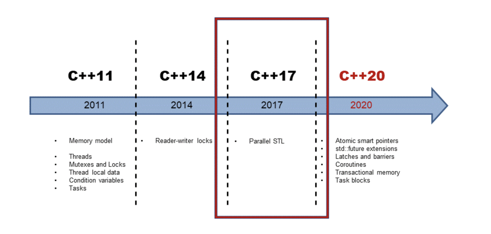
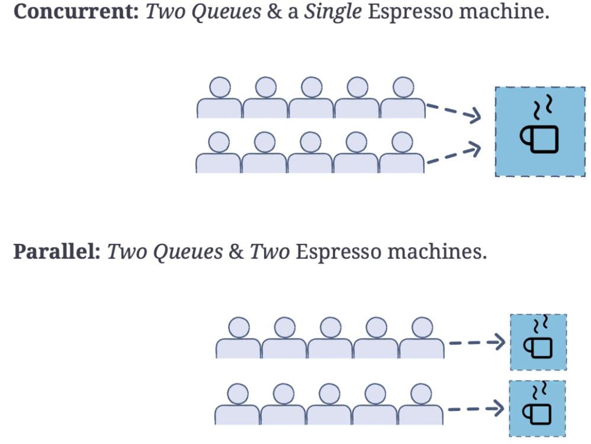
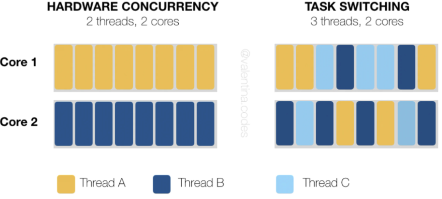

<!--
 * @Author: Uper 41718895+Hyliu-BUAA@users.noreply.github.com
 * @Date: 2022-06-23 11:09:34
 * @LastEditors: Uper 41718895+Hyliu-BUAA@users.noreply.github.com
 * @LastEditTime: 2022-06-23 12:29:17
 * @FilePath: /C_C++/c++_MPI/并行计算/1.md
 * @Description: 这是默认设置,请设置`customMade`, 打开koroFileHeader查看配置 进行设置: https://github.com/OBKoro1/koro1FileHeader/wiki/%E9%85%8D%E7%BD%AE
-->
# A tutorial on modern multithreadings and concurrency in C++
1. In the modern tech climate, concurrency has become an essential skill for all CPP programmers. As programs continue to get more complex, computers are designed with more CPU cores to match.
2. The best way for you to make use of these multicore machines is the coding technique of concurrency.
3. In this tutorial, we’ll get you familiar with concurrent programming and multithreading with the basics and real-world examples you’ll need to know.

# 1. What is `concurrency`?
1. `Concurrency` occurs when multiple copies of a program `run simultaneously` while `communicating with each other`.
2. Simply put, `concurrency` is when two tasks are overlapped. A simple conrrent application will use a single machine to store the program's instructions, but that `process is executed by multiple, different threads`.
3. This setup creats a kind of control flow, where each thread executes its instructions before passing to the next one.
4. The threads act independently and to make decisions based on the previous thread as well. However, some issues arise in concurrency that make it tricky to implement.
5. For example, a `data race` is common issue you may encounter in C++ concurrency and multi-threaded processes. `Data races` in C++ occurs when at `least two threads can simultaneously access a variable or memory location`. This can result in `undefined behavior`. Regardless of its challenges, concurrency is very important for handling multiple tasks at once.

## 1.1. History of C++ concurrency
1. `C++11` is the first C++ standard to introduce concurrency, including:
    - threads
    - C++ memory model
    - condinational variables
    - mutex
    - ...
2. The `C++11` standard changes drastically with `C++17`
3. The addition of parallel algorithms in the Standard Template Library (STL) greatly improved concurrent code.

## 1.3. `Concurrency` vs. `parallelism`
1. Concurrency and parallelism often get mixed up, but it's important to understand the difference.
    - In `parallelism`, we run multiple copies of the same program simultaneously, but they are `executed on different data`
2. For example, you could use parallelism to send requests to different websites but give each copy of the program a different set of URLs. `These copies are not necessarily in communication with each other`, but they are `running at the same time in parallel`.
3. As we explained above, `concurrent programming` involves a `shared memory location`, and the different threads actually “read” the information provided by the previous threads.

# 2. Methods of implementing concurrency
1. In C++, the two most common ways of `implementing concurrency` are through `multithreading` and `parallelism`. 
2. While these can be used in other programming languages. C++ stands out for its concurrent capabilities with lower than average overhead costs as well as its capacity for complex instruction.
3. Below, we’ll explore concurrent programming and multithreading in C++ programming.

## 2.1. C++ `Multithreading`
1. C++ multithreading involves `creating and using thread objects`, seen as `std::thread` in code, to carry out delegated sub-tasks independently. 
2. New threads are passed a function to complete, and optionally some parameters for that function.

3. While each individual thread can complete only one function at a time, `threads pool` allow us to recycle and reuse `thread objects` to give programs the illusion of unlimited multitasking.
4. Not only does this take advantage of `multiple CPU cores`, but it also allows the developers to `control the number of tasks on by manipulating the thread pool size`. The program can then use the computer resources efficiently without overloading becoming overloaded.
5. To better understand thread pools, consider the relationship of worker bees to a hive queen.
    - The `queen (the program)` has a broader goal to accomplish (the survival of the hive) 
    - While the `workers (the threads)` only have their individual tasks given by the queen.
    - Once these tasks are completed, the bees return to the queen for further instruction.
    - At any one time, there is a set number of these workers being commanded by the queen, enough to utilize all of its hive space without overcrowding it.

## 2.2. `Parallism`
1. `Creating different threads is typically expensive` in terms of both `time and memory` overhead for the program. Multithreading can therefore be wasteful when dealing with short simpler functions.
2. For times like these, developers can instead use parallel execution policy annotations, a way of `marking certain functions as candidates for concurrency without creating threads explicitly`.
3. At its most basic, there are `two marks that can be encoded into a function`. 
    - The first is `parallel`, which suggests to the compiler that the function be completed concurrently with other parallel functions. 
    - The other is `sequential`, meaning that the function must be completed individually.
4. Parallel functions can significantly speed up operations because they automatically use more of the computer’s CPU resources.
5. However, it is best saved for functions that have little interaction with other functions using dependencies or data editing. This is because while they are worked on concurrently, there is no way to know which will complete first, meaning the result is unpredictable unless synchronization such as mutex or condition variables are used.
6. While both `multithreading` and `parallelism` are helpful concepts for implementing concurrency in a C++ program, multithreading is more widely applicable due to its ability to handle complex operations. In the next section, we’ll look at a code example of multithreading at its most basic.

# 3. Examples of multithreading
略

# 4. C++ concurrency in action: real-world application
略