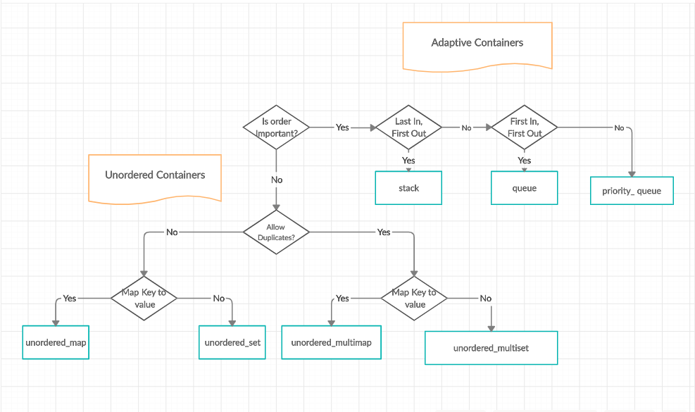

<!--
 * @Author: Uper 41718895+Hyliu-BUAA@users.noreply.github.com
 * @Date: 2022-06-06 13:44:24
 * @LastEditors: Uper 41718895+Hyliu-BUAA@users.noreply.github.com
 * @LastEditTime: 2022-06-06 14:51:52
 * @FilePath: /C_C++/c++_STL/notes/1.简介.md
 * @Description: 这是默认设置,请设置`customMade`, 打开koroFileHeader查看配置 进行设置: https://github.com/OBKoro1/koro1FileHeader/wiki/%E9%85%8D%E7%BD%AE
-->

网址：https://www.geeksforgeeks.org/the-c-standard-template-library-stl/

# C++ STL(Standard Template Library) 简介

1. The `Standard Template Library (STL)` is a set of `C++ template classes` to provide common programming data structures and functions such as:
    - `list`
    - `stack`
    - `array`
    - etc.
2. It is a library of
    - `container classes`
    - `algorithm`
    - `iterator`
3. It is a generalized library and so, its components are parameterized. A working knowledge of `template classes`.

STL has four components
-----------------------
1. `Algorithms`
2. `Containers`
3. `Functions`
4. `Iterators`

# 1. Algorithm

1. The `header file "algorithm"` defines a collection of functions especially designed to be `used on ranges of elements`. 
2. `"Algorithms" act on containers` and provide means of for various operations for contents of the containers.
3. `Algorithm` :
    - `Sorting`
    - `Searching`
    - `Important STL algorithm`
    - `Useful Array algoruthm`
    - `Partition Operations`
4. `Numeric` :
    - `valarray class`

# 2. Containers

1. `Containers` or `container class` store objects and data.
2. There are in total:
    - 7 `standard "first-class" container classes`
    - 3 `container adaptor classes`
    - 7 `header files` : provide access containers or container adaptors.

## 2.1. `Sequence Containers`: implement data structures which can be accessed in `sequential manner`

1. `vector`
2. `list`
3. `deque`
4. `arrays`
5. `forward_list` (introduced in `C++11`)

## 2.2. `Container Adaptors`: provide a different interface for sequential containers

1. `queue`
2. `priority_queue`
3. `stack`

## 2.3. `Associate Containers`: implement sorted data structures that can be quickly searched `(O(log n) complexity)`

1. `set`
2. `multiset`
3. `map`
4. `multimap`

## 2.4. `Unordered Associative Containers`: implement unordered data structures that can be quickly searched

1. `unordered_set` (Introduced in C++11)
2. `unordered_multiset` (Introduced in C++11)
3. `unordered_map` (Introduced in C++11)
4. `unordered_multimap` (Introduced in C++11)

# 3. Functions

1. The STL includes `classes that overload the function call operator`. Instances of such classes are called `function objects` or `functors`. 
    - `Functors`

# 4. Iterators

1. `Iterators` are used for working upon a sequence of values. They are the major feature that allow generality in STL.
    - `iterators`

# 5. Utility Library

1. Defined in header `<utility>`
    - `pair`

